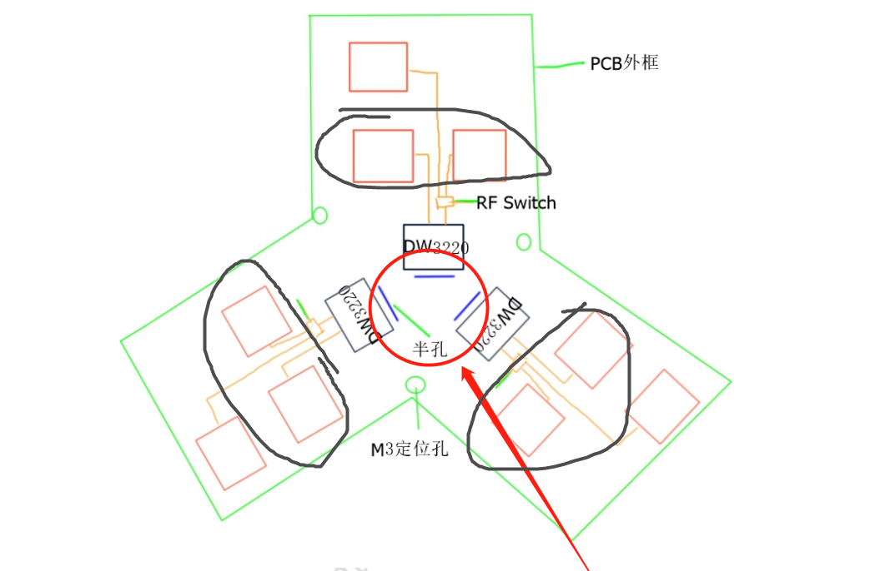
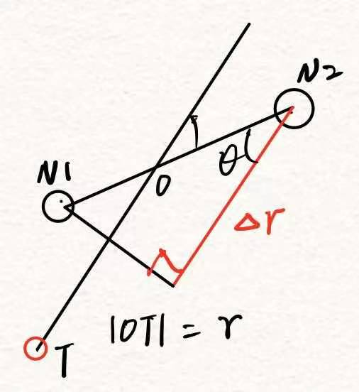

# 单基站AOA定位模型

## 建模

### 基于相位差及距离进行定位

三对天线间隔120°，示意图如下

将标签发射的信号视为以标签到基站原点方向为法向的平面波，则测得的两天线相位差为该平面波到达两个天线（视为两个点）的距离差造成的

三对天线依次排布，分别命名为 $N_1、N_2，N_3、N_4，N_5、N_6$ ，定位目标点记为 $T(x,y,z)$ ，为方便计算，直接近似每对天线连线中心均为基站中心 $O(x_a,y_a,z_a)$ ，令 $r=|TO|$ ，在 $TO$ 方向上，平面波到达两个天线的距离差如图中红色线段表示，记为 $\Delta r$ ，且距离差可根据相位差直接计算得到，设测量的相位差为 $\varphi$ ，根据相位差可计算距离差为

$$
\Delta r=\frac{\lambda\varphi}{2\pi}=|\overrightarrow{N_{12}}|cos\theta \tag{eq1}
$$

其中， $\lambda={c}/{f}$ 表示f频率时的波长，天线间距 $d<=\lambda/2$

通过三维空间向量积公式构建等式如下

$$
\overrightarrow{TO}\cdot\overrightarrow{N_{12}}=|\overrightarrow{TO}||\overrightarrow{N_{12}}|cos\theta
$$

其中， $\Delta r_{12}=|\overrightarrow{N_{12}}|cos\theta$ ， $\overrightarrow{TO}=(x_a-x,y_a-y,z_a-z)$ ， $\overrightarrow{N_{12}}=(x_{12},y_{12},0)$ ， $r=|\overrightarrow{TO}|$ 代入并整理得

$$
(x_a-x)x_{12}  + (y_a-y)y_{12}= r\Delta r_{12}
$$

类比另外两对天线，扩展可得

$$
\begin{aligned}
x_{12}x+y_{12}y&=x_{12}x_a + y_{12}y_a -r\Delta r_{12}\\
x_{34}x+y_{34}y&=x_{34}x_a + y_{34}y_a -r\Delta r_{34}\\
x_{56}x+y_{56}y&=x_{56}x_a + y_{56}y_a -r\Delta r_{56}
\end{aligned}
\tag{eq0}
$$

整理为矩阵形式 $AX=B$ ，其中

$$
A= \begin{bmatrix}
   x_{12} & y_{12} \\
   x_{34} & y_{34} \\
   x_{56} & y_{56}
\end{bmatrix}，
X=\begin{bmatrix}
   x \\
   y
\end{bmatrix}，
B= \begin{bmatrix}
   x_{12}x_a + y_{12}y_a -r\Delta r_{12} \\
   x_{34}x_a + y_{34}y_a -r\Delta r_{34} \\
   x_{56}x_a + y_{56}y_a -r\Delta r_{56}
\end{bmatrix}
$$

三对天线120°间隔布置，有向量旋转关系如下
令 $M(\theta)=\begin{bmatrix}
   cos(\theta) & -sin(\theta) \\
   sin(\theta) & cos(\theta)
\end{bmatrix}$ 表示旋转矩阵，有

$$
\begin{bmatrix}
x_{34} \\y_{34}
\end{bmatrix} = M(120°)\begin{bmatrix}
x_{12} \\y_{12}
\end{bmatrix},\begin{bmatrix}
x_{56} \\y_{56}
\end{bmatrix} = M(240°)\begin{bmatrix}
x_{12} \\y_{12}
\end{bmatrix}
$$

而纵向天线对方向为横向天线对方向-90°，有
$$
\begin{bmatrix}
x_{12\_v} \\y_{12\_v}
\end{bmatrix} = M(-90°)\begin{bmatrix}
x_{12} \\y_{12}
\end{bmatrix}
$$
其他天线同理

由最小二乘法，可计算 $X=(A^TA)^{-1}A^TB$ ，结果代入 $r=\sqrt{(x_a-x)^2+(y_a-y)^2+(z_a-z)^2}$ ，可计算出 $z$ ，由此，定位解算完毕

### 到达角关系

由于三对天线的方向向量形成封闭三角形，有

$$
\overrightarrow{N_{12}} + \overrightarrow{N_{34}} + \overrightarrow{N_{56}} = \overrightarrow{0}
$$

作向量加法
$$
\overrightarrow{TO}\cdot\overrightarrow{N_{12}} +\overrightarrow{TO}\cdot\overrightarrow{N_{34}}+\overrightarrow{TO}\cdot\overrightarrow{N_{56}}=|\overrightarrow{TO}||\overrightarrow{N_{12}}|cos\theta_{12} +|\overrightarrow{TO}||\overrightarrow{N_{34}}|cos\theta_{34} +|\overrightarrow{TO}||\overrightarrow{N_{56}}|cos\theta _{56}
$$
代入**eq1**，有
$$
\overrightarrow{TO}\cdot(\overrightarrow{N_{12}} + \overrightarrow{N_{34}} + \overrightarrow{N_{56}})=|\overrightarrow{TO}|(\frac{\lambda\phi_{12}}{2\pi}+\frac{\lambda\phi_{34}}{2\pi}+\frac{\lambda\phi_{56}}{2\pi})
$$
也即
$$
\phi_{12}+\phi_{34}+\phi_{56}=0
$$
三对天线测量的pdoa相位差之和等于零，可用于异常值评估

### 纯PDOA测量空间角

当 r 未知，仅有三个 pdoa 时，可计算出极坐标的两个角度

设空间任意点 M，它在直角坐标系中的坐标为（x，y，z），则如下的有序数组（r，φ，θ）称为点 M 的球坐标：坐标 r 是点 M 到原点的距离，φ 是通过 z 轴和点 M 的半平面与坐标面 zOx 所构成的角；θ 是线段 OM 与 z 轴正方向的夹角，因此，在空间中这些坐标的变化范围是：

$$
\begin{array}{rcl}
0 &\leq r &< +\infty\\
-\pi &\leq \varphi &\leq \pi \\
0 &\leq \theta &\leq \pi
\end{array}
$$

转换关系如下

$$
\begin{array}{c}
x=&r\sin\theta\cos\varphi \\
y=&r\sin\theta\sin\varphi \\
z=&r\cos\theta
\end{array}\tag{eq2}
$$

$$
\begin{array}{c}
r=&\sqrt{x^{2}+y^{2}+z^{2}} \\
\theta=&\arctan \left(\sqrt{x^{2}+y^{2}}/z\right) \\
\varphi=&\arctan (y / x)
\end{array}
$$

将 `eq2` 代入 `eq0` ，移动坐标系原点到基站位置，则基站坐标 $O(x_a=0,y_a=0,z_a=0)$ ，有

$$
\begin{array}{c}
    x_{12}\sin\theta\cos\varphi+y_{12}\sin\theta\sin\varphi= -\Delta r_{12}\\
    x_{34}\sin\theta\cos\varphi+y_{34}\sin\theta\sin\varphi= -\Delta r_{34}\\
    x_{56}\sin\theta\cos\varphi+y_{56}\sin\theta\sin\varphi= -\Delta r_{56}
\end{array}
$$

类比前面，整理为矩阵形式 $AX=B$ ，其中

$$
A= \begin{bmatrix}
   x_{12} & y_{12} \\
   x_{34} & y_{34} \\
   x_{56} & y_{56}
\end{bmatrix}，
X=\begin{bmatrix}
   \sin\theta\cos\varphi \\
   \sin\theta\sin\varphi
\end{bmatrix}，
B= -\begin{bmatrix}
   \Delta r_{12} \\
   \Delta r_{34} \\
   \Delta r_{56}
\end{bmatrix}
$$

最小二乘计算得 $X=[a,b]^T$ ，进一步解得
$$
\begin{array}{c}
\varphi =& arctan(b/a)\\
\theta =& \begin{cases}
\begin{array}{c}
arcsin\sqrt{a^2+b^2} \qquad &z \geq 0\\
\pi - arcsin\sqrt{a^2+b^2} \qquad &z < 0
\end{array}
\end{cases}
\end{array}
$$

## 仿真

同样 设计定高螺旋线，根据螺旋线上点的坐标向量和天线向量之间角度关系以及天线距离反向计算距离差，进一步转换到原始相位差，另外还需要计算定位点到基站中心的距离，当在 matlab 代码文件中选择 `dataSource` 为实际采集的数据时，绘图将没有 groundtruth

目前还没有采集 dw3000 的实际数据，仅仿真，直接运行 `main.m` 即可
