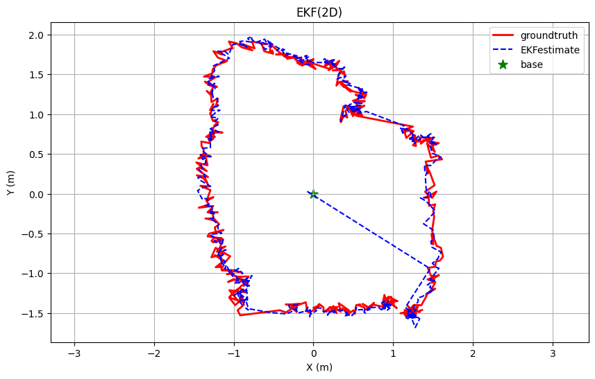

# 工业实习报告

**认证课程：** 工业实习  
**学　　号：** 12212008  
**姓　　名：** 于荣焰  
**书　　院：** 树德书院  
**班　　级：** 2220  
**指导人员：** 许鑫颖  
**日　　期：** 2025年9月4日  

---

## 目录

- **第一章：实习任务描述**
  - 1.1 项目背景与目标

- **第二章：项目实现过程与阶段成果**
  - 2.1 理论基础
  - 2.2 研究方法
  - 2.3 问题与挑战

- **第三章：经验总结**
  - 3.1 AI辅助学习的双刃剑效应
  - 3.2 数据质量意识与误差分析能力
  - 3.3 理论与实践的综合提升
  - 3.4 职业素养的全面提升
  - 3.5 对未来发展的影响

---

## 第一章：实习任务描述

### 1.1 项目背景与目标

随着物联网（IoT）、智能感知与自动化技术的飞速发展，人们对位置信息服务的需求已从广阔的室外空间延伸至复杂的室内环境。在诸如智慧工厂、仓储物流、无人导引、人员监护以及增强现实（AR）等应用场景中，获取米级乃至厘米级的实时、鲁棒的室内位置数据已成为核心关键技术之一，具有巨大的研究价值和广阔的应用前景。

然而，传统的室内定位技术如Wi-Fi、蓝牙（BLE）等，由于信号带宽有限、易受多径效应干扰等因素，其定位精度通常在米级范围，难以满足高精度应用的需求。尽管视觉SLAM等技术能提供较高精度，但其依赖环境特征、计算复杂度高且易受光线影响，在诸多场景下存在局限性。

超宽带（Ultra-Wideband, UWB）技术因其独特的物理特性，为破解室内高精度定位难题提供了全新的解决方案。UWB技术通过发射纳秒级的非正弦窄脉冲来传输数据，具有极宽的信号带宽（通常>500MHz）、极强的时间分辨率、极低的功率谱密度和强大的抗多径干扰能力。这些特性使得UWB在测距与定位方面展现出显著优势：

- **高精度测距：** 基于到达时间差（TDOA）或双向测距（TWR）原理，测距精度可达厘米级。
- **强抗干扰性：** 宽频谱特性使其能将多径信号分离，易于识别直达路径，从而在复杂室内环境中保持稳定性能。
- **高实时性：** 数据传输速率高，能支持目标的实时动态跟踪。

本项目旨在设计与实现一个基于UWB技术的室内高精度定位系统。本研究将围绕UWB的核心测距模型，通过部署固定基站网络与移动标签，采集并分析标签与基站之间的原始距离与载波相位差（Phase Difference of Arrival, PDoA）数据。

---

## 第二章：项目实现过程

### 2.1 理论基础

本项目的定位系统核心在于通过处理UWB射频信号获取高精度的几何测量值，并利用先进的估计算法在动态环境中实现鲁棒跟踪。其理论基础主要涵盖以下两个方面：

#### 2.1.1 载波相位差测角（PDoA）原理

载波相位差（Phase Difference of Arrival, PDoA）是一种基于UWB信号载波相位信息进行角度估计的技术。本系统采用的基站配备多根天线，利用这些天线构成一个短基线阵列。

##### • 相位差与波程差的关系：

当标签距离基站较远时，其发射的电磁波可视为平面波。信号以不同角度到达天线阵列时，会在相邻天线之间产生微小的传播路径差，即**波程差**（$\Delta d$）。该波程差会导致信号在相邻天线间产生一个**相位差**（$\Delta \phi$），其关系为：

$$
\Delta \phi = \frac{2\pi}{\lambda} \cdot \Delta d
$$

其中，$\lambda$ 为UWB信号的载波波长。

##### • PDoA测角模型：

联立上述公式，即可建立相位差与入射角之间的直接联系，从而通过测量相位差来解算信号的到达角度（Angle of Arrival, AoA）：

$$
\theta = \arcsin\left( \frac{\lambda \cdot \Delta \phi}{2\pi L} \right)
$$

**重要性**：PDoA技术提供了高精度的角度测量，与基于时间戳的测距信息（如TOF）相结合，构成了单基站实现二维定位的几何基础，极大地减少了所需基站的数目。

#### 2.1.2 扩展卡尔曼滤波（EKF）算法

卡尔曼滤波（KF）是一种最优递归估计算法，用于从一系列包含噪声的观测数据中估计动态系统的状态。然而，标准的KF仅适用于线性系统。UWB的定位模型（距离、角度与状态的关系）是非线性的，因此本项目采用其非线性变体——**扩展卡尔曼滤波（EKF）**。

EKF通过局部线性化处理非线性问题，其核心步骤分为预测和更新两阶段：

##### • 1. 状态预测（Prediction）：

根据系统上一时刻的状态估计和运动模型，预测当前时刻的状态和误差协方差。

$$
\begin{aligned}
\hat{x}_{k|k-1} &= f(\hat{x}_{k-1|k-1}, u_{k-1}) \\
P_{k|k-1} &= F_k P_{k-1|k-1} F_k^T + Q_k
\end{aligned}
$$

其中，

- $\hat{x}_{k|k-1}$ 是预测状态向量（通常包含位置、速度等）；
- $f(\cdot)$ 是描述系统动态的非线性状态转移函数；
- $P_{k|k-1}$ 是预测估计协方差矩阵；
- $F_k$ 是 $f(\cdot)$ 的雅可比矩阵（Jacobian），即状态转移函数的局部线性化近似；
- $Q_k$ 是过程噪声协方差矩阵。

##### • 2. 测量更新（Update）：

利用当前时刻的实际测量值（如从UWB基站得到的距离和PDoA角度）来修正预测值，得到更优的状态估计。

$$
\begin{aligned}
K_k &= P_{k|k-1} H_k^T (H_k P_{k|k-1} H_k^T + R_k)^{-1} \\
\hat{x}_{k|k} &= \hat{x}_{k|k-1} + K_k (z_k - h(\hat{x}_{k|k-1})) \\
P_{k|k} &= (I - K_k H_k) P_{k|k-1}
\end{aligned}
$$

其中，

- $z_k$ 是实际测量向量（如距离、角度）；
- $h(\cdot)$ 是描述状态与测量值之间关系的非线性观测函数；
- $H_k$ 是 $h(\cdot)$ 的雅可比矩阵，即观测函数的局部线性化近似；
- $R_k$ 是观测噪声协方差矩阵；
- $K_k$ 是卡尔曼增益，决定了相信预测模型还是观测数据的程度。

**在本项目中的角色**：EKF作为数据融合的核心算法，负责将来自基站天线阵列的相位差信息和距离信息进行最优融合。同时，它通过引入合理的运动模型（如匀加速模型），能够有效平滑UWB原始测量数据中的噪声和野值，并对标签的运动状态（如速度）进行估计，从而在动态跟踪中提供更稳定、更精确的定位结果。

### 2.2 项目过程与阶段成果
#### 2.2.1 卡尔曼滤波理论的学习与掌握
在项目初始阶段，我系统性地学习了卡尔曼滤波的理论基础及其在定位领域的应用，包括如下：
• 基础卡尔曼滤波原理​：深入理解状态空间模型、预测-更新机制、协方差传播等核心概念
• 扩展卡尔曼滤波推导​：重点学习非线性系统的线性化方法，掌握雅可比矩阵的计算
• UWB观测模型分析​：研究距离和角度测量模型，分析特性

#### 2.2.2 仿真模型EKF算法搭建与优化
基于学会的卡尔曼滤波理论，我用仿真得到的相位差和距离数据，设计了流程相对完善的EKF算法，效果也较好，说明由理论搭建的算法是有效的，如图所示

其中，蓝色为算法得到的轨迹，红色为仿真的真实轨迹

#### 2.2.3 真实模型EKF算法优化
在仿真模型基础上，使用真实带噪声的数据，对EKF算法做了如下优化：
• 采集数据，计算实际噪声标准差参数并应用
• 优化模型为匀加速模型（CA模型，将加速度噪声是为过程噪声Q）
效果如图所示：

其中，蓝色为算法得到的轨迹，红色为原数据真值反推得到的轨迹（非真实轨迹）

#### 2.2.4 实时模型EKF算法优化
在真实模型的基础上，实时处理每一帧的相位差和距离信息，得到实时的轨迹预测结果，优化步骤如下：
• 校准原始相位差数据
• 可视化实时的相位差信息，距离信息和实时的轨迹信息
• 优化实际采集到的异常值数据（由初步的舍去异常帧，到翻转较多的2pi相位差突变，再到最后的马氏距离处理异常值）
• 引入高度约束，让整体坐标预测更准确
• 对真实多变的噪声分布处理，以不同比例对应放大当前观测量的某个或某些观测指标

    

        
        
室内6m圆形轨迹

    

    

        
        
空旷19m×40m矩形轨迹

    

    

        
        
空旷19m×40m矩形轨迹

    

### 2.3 问题与挑战

#### 2.3.1 技术文档规范化的挑战
在完成仿真算法的初步实现后，我接到了撰写算法公式文档的任务。起初，我对"文档"的理解局限于数学原理的推导，因此提交了一份手写的公式说明。虽然内容核心正确，但在格式规范上与期望存在差距。主管明确了需要的是结构清晰、便于传播和存档的Markdown格式技术文档。

**解决与收获：** 我迅速重新学习了Markdown语法，特别是数学公式的编写规范，最终独立完成了符合要求的公式文档。这个过程虽然增加了初期的时间成本，但通过系统性地梳理算法理论，加深了我对EKF状态模型和观测模型的理解，为后续的算法调试和优化奠定了更坚实的理论基础。

#### 2.3.2 实时数据中异常值的处理挑战
在系统中期集成与实时数据采集阶段，观测值（四个相位差和一个距离）频繁出现异常波动，严重影响了定位算法的稳定性和精度。如何有效处理这些异常值，成为保障系统可靠性的关键挑战。

**解决策略与迭代优化：**
我设计并实施了一个多层次的渐进式处理方案：
1.  **初步尝试：** 最初采用了直接丢弃异常数据帧的简单策略，但很快发现这会导致数据流不连续，破坏系统完整性，并非最优解。
2.  **规律识别与修正：** 通过分析数据特征，我发现大量异常表现为相位差的360°跳变（相位模糊）。对此，我实现了自动检测并校正这种周期性跳变的逻辑，有效解决了一类系统性异常。
3.  **动态噪声适配：** 对于非周期性、幅值较大的噪声，我借鉴马氏距离的概念计算当前观测的异常程度，并据此动态调整EKF中观测噪声协方差矩阵`R`的尺度。即在异常时降低对该观测量的信任度，而非直接丢弃，实现了算法的自适应鲁棒性。

通过上述层层递进的优化策略，我最终显著提升了系统在真实噪声环境下的滤波稳定性和定位精度。

## 第三章：经验总结
### 3.1 AI辅助学习的双刃剑效应
在项目初期的卡尔曼滤波学习阶段，我深刻体会到AI工具在技术学习中的双重作用。借助AI的帮助，我确实能够快速构建出EKF算法的基本框架，并在较短时间内实现初步功能。这种高效的学习方式让我迅速跨越了入门门槛，直接获得了可运行的算法实现。

然而，这种"快餐式"的学习方式也带来了明显的弊端。由于对卡尔曼滤波的理论基础理解不够深入，特别是在状态转移矩阵设计、协方差矩阵调参、非线性系统线性化等关键环节，我花费了大量时间进行试错性调整。当遇到算法收敛性问题或定位精度不达标时，由于缺乏扎实的理论基础，排查和优化过程变得异常艰难。

这一经历让我认识到：​AI工具应该作为知识获取的辅助手段，而非替代深度学习的捷径。在后续的工作中，我调整了学习策略，先通过传统方式深入理解算法原理，再使用AI进行代码优化和方案验证，这样既保证了理论基础扎实，又提高了工作效率。
### 3.2 数据质量意识与误差分析能力
在实际数据采集和测试过程中，我遇到了多次"算法正确但结果异常"的情况。这些经历极大地提升了我的数据质量意识和误差分析能力.
通过反复测试，我学会了区分随机误差和系统误差。同时，我也培养了严谨的科学态度：​绝不为了美化结果而进行错误的数据矫正。

 ### 3.3 理论与实践的综合提升
本次实习让我在定位算法领域获得了显著成长：
#### 3.3.1 算法能力的深化
通过实际项目，我不仅掌握了卡尔曼滤波的理论知识，更深入理解了：
•状态空间模型在实际系统中的应用技巧
•噪声协方差矩阵对滤波效果的敏感度影响
•非线性系统线性化的各种方法及其适用场景
#### 3.3.2 工程实践能力的提升
在UWB定位系统的实现过程中，我学会了：
•实时系统的性能优化方法
•硬件限制下的算法妥协与权衡
### 3.4 职业素养的全面提升
从最初的遇到问题就求助，到后来能够独立分析并解决问题，我的系统性思维能力得到了显著提升。现在面对技术难题时，我能够快速定位问题根源，设计有效的验证方案并制定可行的解决策略。
通过撰写技术报告和实验记录，我培养了良好的文档习惯，认识到详细记录实验过程、参数设置和结果分析对项目复盘和技术积累的重要性。
### 3.5 对未来发展的影响
这次实习经历对我个人和职业发展产生了深远影响：
1.​技术方向的明确​：增强了我对感知算法和定位技术领域的兴趣，为未来职业发展指明了方向。
2.​学习方法的优化​：形成了"理论深度理解+实践快速验证"的高效学习模式。
3.​工程思维的建立​：培养了从系统角度思考问题的能力，注重技术的可行性和实用性。
4.​职业信心的提升​：通过解决实际工程问题，增强了作为工程师的技术自信。

这段经历不仅让我掌握了具体的技术技能，更重要的是培养了作为工程师应有的严谨态度、解决问题的能力和终身学习的习惯，这些都将成为我未来职业发展的宝贵财富。